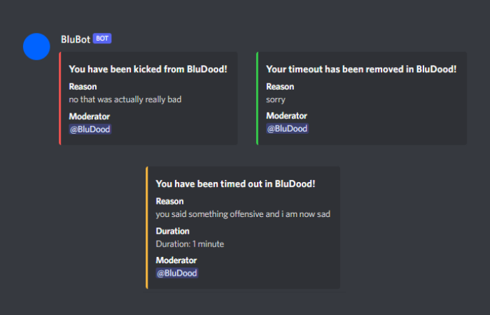
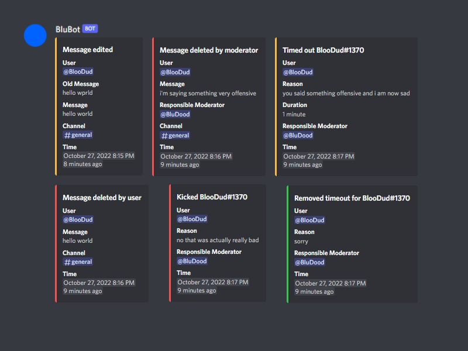
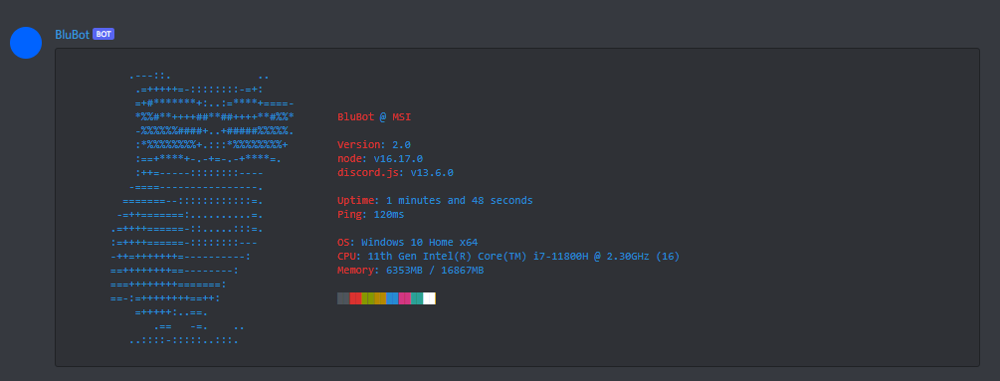
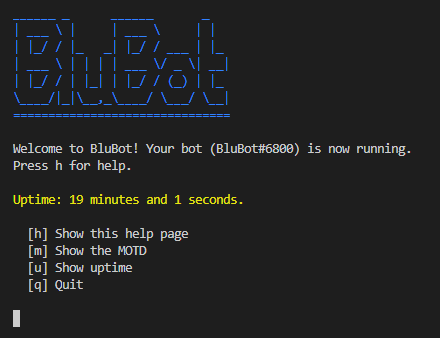

# BluBot

A self-hosted Discord bot with various moderation features and fun commands. Features a simple CLI and setup script for easy management.

## Features

- Automatic moderation
  - Censor list (deprecated by Discord AutoMod?)
  - Phish protection (powered by phish.sinking.yachts)
- Moderation
  - Ban, kick, timeout members
  - Purge messages by channel and/or user
  - Lock channels
- Logging
  - Any moderation action
  - Deleted and edited messages
  - Automatic moderation actions
- Misc
  - Get user avatar
  - Define a word using Urban Dictionary
  - Neofetch-like status command
  - Ping command
  - Your Mom jokes (powered by yomomma.info)
- Setup
  - Guided setup with customization options
- CLI
  - Simple CLI with ASCII art and uptime command (more coming soon)

## Setup

0. Install NodeJS
1. Clone this repository
2. Run `npm run setup` and follow the steps
3. Run `npm install` to install dependencies
4. Run `npm start` to start the bot

## Screenshots

### Direct Messages

### Logs

### Neofetch command (Discord ANSI support)

### CLI

## Support

Want to request a new feature or report a bug?

[Join my Discord Server](https://blnk.ga/dc)
or
[send me an email](mailto:bludood@bludood.com)!
